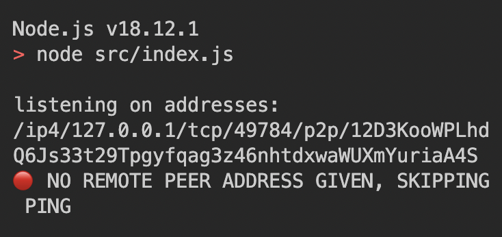
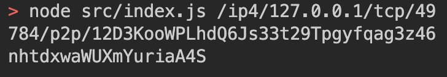
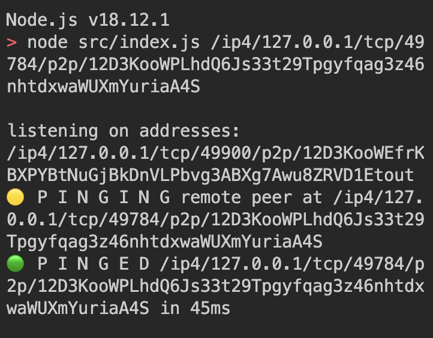

# js-libp2p-node

## libp2p is a modular system of protocols, specifications and libraries that enable the development of peer-to-peer network applications.

### Follow these steps to clone the repo and ping a connected peer!

1. `git clone git@github.com:Pryority/js-libp2p-node.git`

2. `cd js-libp2p-node && yarn install`

3. `node src/index.js`

    > You will see this ↓ because there is only 1 peer connected
    > 

4. Copy the entire /ip4/... address -- in the example above, the exact section copied is '/ip4/127.0.0.1/tcp/49784/p2p/12D3KooWPLhdQ6Js33t29Tpgyfqag3z46nhtdxwaWUXmYuriaA4S'

5. Open a second terminal window

6. In the new terminal window, enter the node command again (`node src/index.js`), but add the copied address from step 4 at the end.

    > 

7. If done correctly, you will see the console log the address that Peer 2 is listening on, which is different from Peer 1 (in example, Peer 2's address is /ip4/127.0.0.1/tcp/49900/p2p/12D3KooWEfrKBXPYBtNuGjBkDnVLPbvg3ABXg7Awu8ZRVD1Etout -- see below), as well as a log that Peer 1 is pinging Peer 2, and finally the success log when the Ping completes (and how long it took).

    > 

---